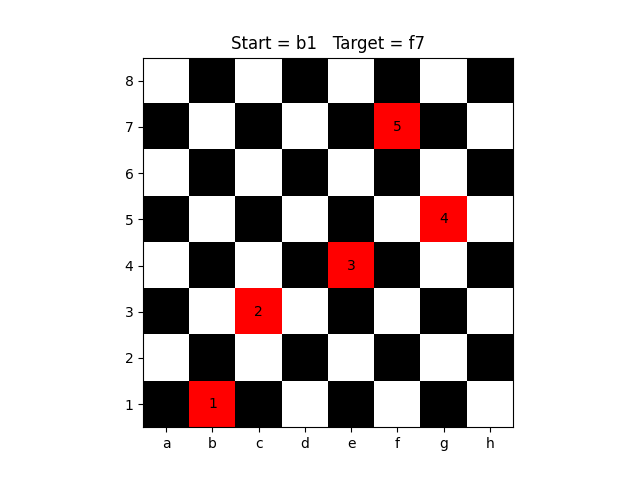

<h1 align="center"><a href="https://www.techiedelight.com/chess-knight-problem-find-shortest-path-source-destination/">
Chess Knight Tour</a> Visualizer</h1>

  

  
***
## Overview

### Stack

Solution to shortest knight tour problem done using `python 3.9`, visualization is done using `matplotlib`. 

### Approach
Algorithm used here is a little bit modified [BFS](https://en.wikipedia.org/wiki/Breadth-first_search) on the graph of all the possible moves that the knight might take.

### Install requirements
`pip install -r requirements.txt`  

### Run visualization
`python knight_path.py`
